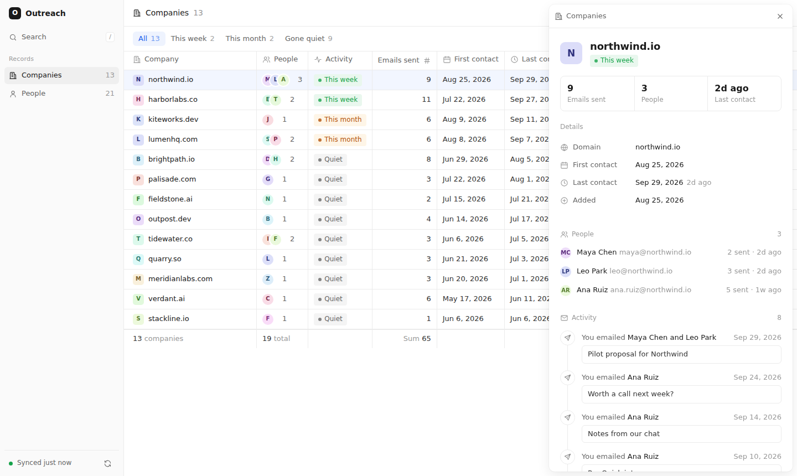

# Outreach CRM

A minimal CRM that fills itself in from your sent mail. You never enter anything: every email you send is picked up, and the people and companies you emailed appear with their dates and counts.



For each **company** (grouped by email domain) and each **person** (name and email address) it shows:

| Column | Meaning |
|---|---|
| Added | When the CRM first picked them up |
| First contact | The date of the first email you sent them |
| Last contact | The date of the most recent email you sent them |
| Emails sent | How many times you contacted them. For a company, one email to three people there counts once |
| Activity | This week, This month, or Quiet (no email in over 30 days). The filters at the top use the same groups |

Click any row to open a side panel with its details, the people at that company, and a timeline of every email you sent with its subject line. Press `/` to search and `Esc` to close the panel.

The layout follows Attio and Twenty: a sidebar, a dense table with grid lines, and a side panel for each record. It follows your system's light or dark mode.

## How it works

The server connects to your mailbox over IMAP, reads the headers (To, Cc, Bcc, Date, Subject) of your **Sent** folder and stores who each email went to in `data/crm.json`. Message bodies are never downloaded and nothing is ever sent or changed in your mailbox (the folder is opened read-only).

- The first sync looks back `SYNC_SINCE_DAYS` (default 365). After that it checks for new sent mail every `SYNC_INTERVAL_MINUTES` (default 5), and **Sync now** checks straight away.
- Re-syncing never double counts: each email is stored once by its Message-ID.
- Skipped automatically: you, your other addresses, colleagues on your own work domain, and robot addresses (`noreply@`, `notifications@` …).
- People on personal domains (gmail.com, outlook.com …) are tracked as people, marked **Personal**, and not grouped into a company.
- Use `IGNORE_DOMAINS` / `IGNORE_EMAILS` for anyone you email who isn't outreach.
- Company logos are loaded from DuckDuckGo's favicon service, which means it sees those domains. Set `COMPANY_LOGOS=off` to show letters instead.

## Setup

Requires Node.js 22 or newer.

```bash
cd crm
npm install
cp .env.example .env   # then fill in your mailbox details
npm start              # open http://localhost:3000
```

**Gmail / Google Workspace:** set `IMAP_USER` to your address and `IMAP_PASSWORD` to an [app password](https://myaccount.google.com/apppasswords) (needs 2-step verification on). Leave the host as `imap.gmail.com`. Your normal password will not work.

**Outlook / Microsoft 365:** set `IMAP_HOST=outlook.office365.com`. Other providers: use their IMAP host; the Sent folder is found automatically, or set `SENT_MAILBOX`.

Keep it running (for example with `pm2 start npm -- start`, or a login item) and it stays up to date on its own. The server only listens on `localhost` because there is no login.

## Try it without a mailbox

```bash
npm run demo
```

Loads made-up data into `data/demo.json` and starts the UI with syncing turned off.

## Tests

```bash
npm test
```

## Files

- `server.js` — web server and the sync schedule
- `lib/sync.js` — reads the Sent folder over IMAP
- `lib/store.js` — records sent emails and works out every date and count
- `lib/config.js`, `lib/domains.js` — settings, and which addresses count as leads
- `public/index.html` — the whole UI, no build step
